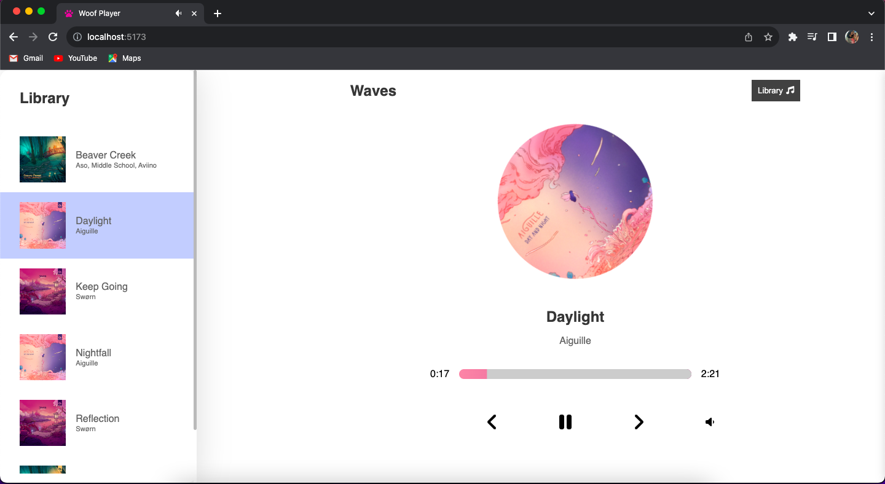

# 💻 Woof Player(BETA)

Chihuahua approved chill music player.

## ✨ Live Demo

You can look at it [here]().

## Author

👤 Elizabeth Villalejos

- [Github](https://github.com/misselliev)
- [Linkedin](https://linkedin.com/elivillalejos)
- [Dev.to](https://dev.to/misselliev)
- [Twitter](https://twitter.com/miss_elliev/)
- [Email](mailto:elizabeth.villalejos@gmail.com?subject=Website%20Inquiry)

## 🤝 Contributing

Contributions, issues and feature requests are welcome!

Feel free to check the [issues page](issues/).

## Show your support

Give a ⭐️ if you like this project!

> “What simple action could you take today to produce a new momentum toward success in your life?” Tony Robbins